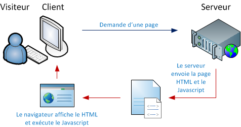

##Partie 1 : Les bases du Javascript

### Premiers pas en Javascript

##### 1 - Qu'est ce que le javascript ?

Le Javascript est à ce jour utilisé majoritairement sur Internet, conjointement avec les pages Web (HTML ou XHTML). Le Javascript s'inclut directement dans la page Web (ou dans un fichier externe) et permet de dynamiser une page HTML, en ajoutant des interactions avec l'utilisateur, des animations, de l'aide à la navigation, comme par exemple :

Afficher/masquer du texte ;

Faire défiler des images ;

Créer un diaporama avec un aperçu « en grand » des images ;

Créer des infobulles.

Le Javascript est un langage dit client-side, c'est-à-dire que les scripts sont exécutés par le navigateur chez l'internaute (le client). Cela diffère des langages de scripts dits server-side qui sont exécutés par le serveur Web. C'est le cas des langages comme le PHP.

C'est important, car la finalité des scripts client-side et server-side n'est pas la même. Un script server-side va s'occuper de « créer » la page Web qui sera envoyée au navigateur. Ce dernier va alors afficher la page puis exécuter les scripts client-side tel que le Javascript. Voici un schéma reprenant ce fonctionnement :



Javascript est un langage dit client-side, c'est à dire interprété par le client (le visiteur)


```javascript
alert('Hello World!');
```
	
<a href="part1.html">HTML</a>
	
##### 2 - Variables

Déclaration de variable

```javascript
var firtsname = 'Homer';
```

##### 3 - Tableaux

```javascript
var family = new Array('Homer', 'Marge', 'Bart', 'Lisa', 'Maggie');
```
